# Synaps (AI driven and statistical log Analyser)

# How to use

---

## Deploying the services

This will build deploy the entire project's infrastructure

```bash
make rebuild-all
```

> Important note: make sure to pull a specific ollama model (you will need it for report generation), or you can simply pass the llm api of your choice in the compose file to the _`llm-analyzer`_ service via ( _`OLLAMA_HOST`_: http://host:port, _`OLLAMA_MODEL`_) and comment out the ollama service and volumes.

## Log-generator and LLM-analyzer services notes

You can also set the time range and anomaly spike days and hours you desire for the `log-generator` service before doing `make rebuild-all` and deploying the services.

```bash
LOG_RATE_PER_SECOND: 1
ERROR_RATE_PERCENTAGE: 3 #3 #40 (how many logs can be level ERROR/FATAL)
SERVICES: "api-gateway,user-service,payment-service,notification-service,auth-service" # services mock data to generate
HISTORICAL_MODE: true # backfilling mock data -> false if you want real-time (today onwards)
HISTORICAL_START_DATE: 1/12/2025 #"15/12/2025" # 1/12/2025
HISTORICAL_END_DATE: 8/12/2025 #"30/12/2025" # 15/12/2025
ANOMALY_SCHEDULE: "1-3,1-15,5-21" # (Monday 3 AM, Monday 15 PM, Friday 21 AM). Format: day_of_week-hour e.g., "1-3,1-15,5-21" (1=Monday (3am, 3pm), 7=Sunday(11pm); 0-23 = 00:00 to 23:00)
ANOMALY_MULTIPLIER_MIN: 1.0 #4.0 random multiplication factor for error percentage
ANOMALY_MULTIPLIER_MAX: 2.0 #8.0 random multiplication factor for error percentage
```

For a good test experience I advise:

- generating one week of data (_1/12/2025_ to _8/12/2025_) with `ERROR_RATE_PERCENTAGE: 3`, `ANOMALY_MULTIPLIER_MIN: 1.0` and `ANOMALY_MULTIPLIER_MAX: 2.0`, `ANOMALY_SCHEDULE: "1-3,1-15,5-21"`, these will allow you to have very low error rate which simulates a healthy system.

- Then generate a baseline with _http://localhost:8002/baselines/calculate_, this will create you ground truth to which next week's data will be compared.

- Generating another week's worth of data (_8/12/2025_ to _15/12/2025_) with `ERROR_RATE_PERCENTAGE: 30`, `ANOMALY_MULTIPLIER_MIN: 4.0` and `ANOMALY_MULTIPLIER_MAX: 8.0`, `ANOMALY_SCHEDULE: "1-3,1-15,5-21"`, these will allow you to generate data that is not consistant with you baseline and therefore be flaged by the z-score chart referenced in the [z-score anomaly detection dashboard](#42-z-score-anomaly-detection).

> Important note: the log-generator stops generating logs to kafka after reaching the end date defined by the variable **`HISTORICAL_END_DATE`**.

If you decide to use ollama

```bash
~$ docker exec -it ollama sh
~$ ollama pull deepseek-coder:6.7b # this can be any model please check smaller LLM models online
~$ ollama list
# ollama list installed models
NAME                   ID              SIZE      MODIFIED
deepseek-coder:6.7b    ce298d984115    3.8 GB    2 days ago
```

## Generating a report:

First `calculate a baseline` (needs to be done at least once). By default the `llm-service` does this a baseline recalculation every 7 days (7 real days via scheduler).

```bash
curl -X POST http://localhost:8002/baselines/calculate -H "Content-Type: application/json"
```

Then generate the report

```bash
curl -X POST http://localhost:8002/analyze \
  -H "Content-Type: application/json" \
  -d '{
    "start_time": "2025-12-16T00:00:00Z",
    "end_time": "2025-12-17T00:00:00Z",
    "services": [
      "api-gateway",
      "user-service",
      "payment-service",
      "notification-service",
      "auth-service"
    ]
  }'
```

By the default the frontend `/pages` components uses a mock api, if you want see the data you have generated, make sure change the `USE_MOCK_API = false` in every component under `frontend/src/pages/*`.

The report generation (`/analyze`) api will also generate new patterns (`ERROR`, `WARN`, `FATAL`) for that report, which will either be new patterns or update trends of existing patterns.

## Jina-embeddings service

This service vectorizes log messages using [`Matryoshka Embeddings`](https://sbert.net/examples/sentence_transformer/training/matryoshka/README.html) of `size 768`, inspired by the famous Russian nesting doll.

Please update `JINA_API_KEY` in the [docker-compose](infrastructure/docker-compose.yml) with one provided on the jina-embeddings website [here](https://jina.ai/api-dashboard/embedding). It provide you with 10 million free tokens, this is far more than enough for testing the app.

# More details

If you want more details about the project's architecture and flow have a look at the [full project details here](documentation/README.md).

# Screens

---

## 1. Main dashboard

Here you can see the you can the live ingestion dashboard with metrics about log ingestion
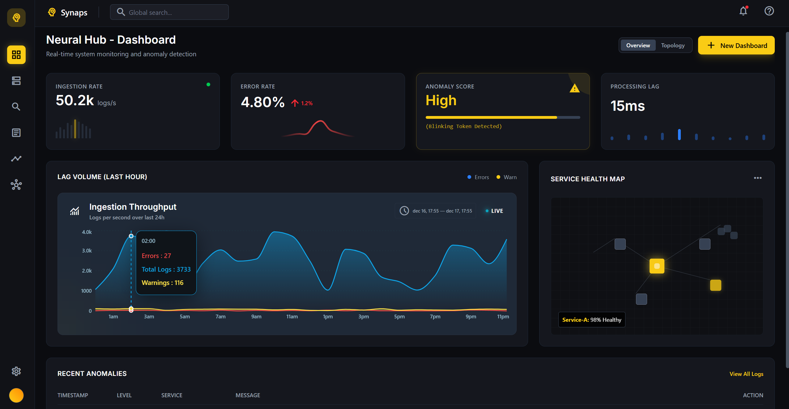

## 2. Data cortex (granular live logs)

Data cortex - the second screen show live information about what kind of logs are coming into the system
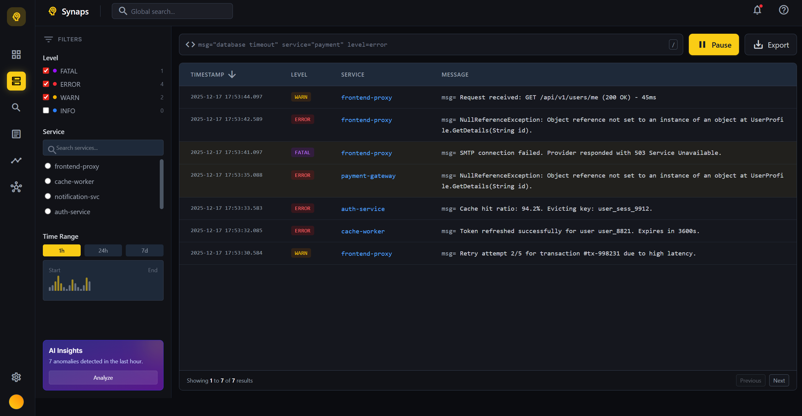

## 3. Cognitive search (semantic search)

Semantic search looks for logs based on key words and patterns and clusters them based on pattern, services, error level, etc.

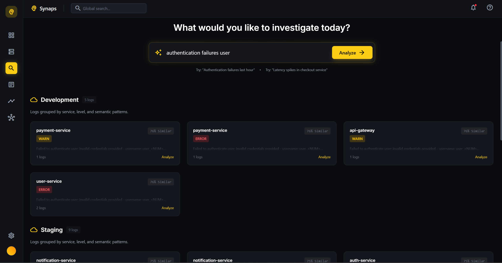

### 3.1. Expanded log group

Below you can see what the information is contained within a log group, like how many logs share the pattern, the similarity score, the error level and even the range of time these logs cover

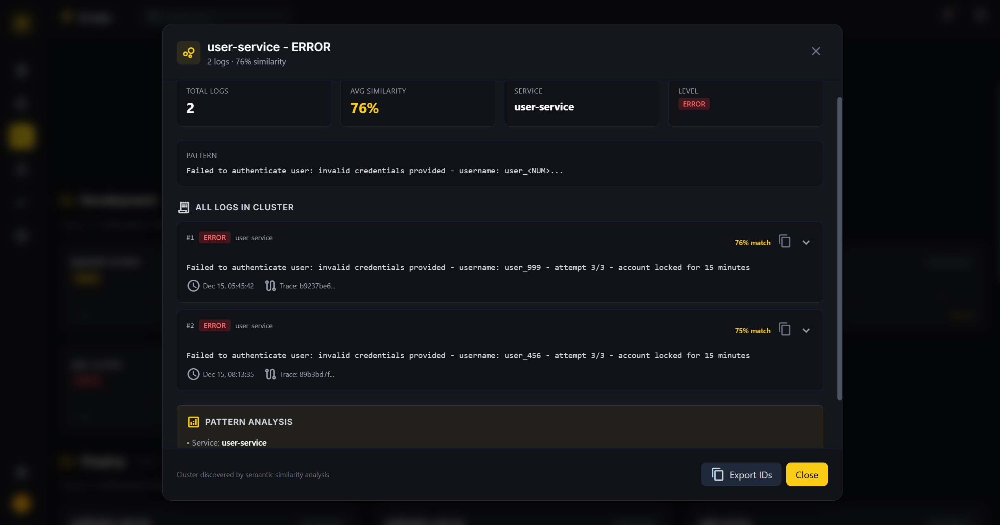
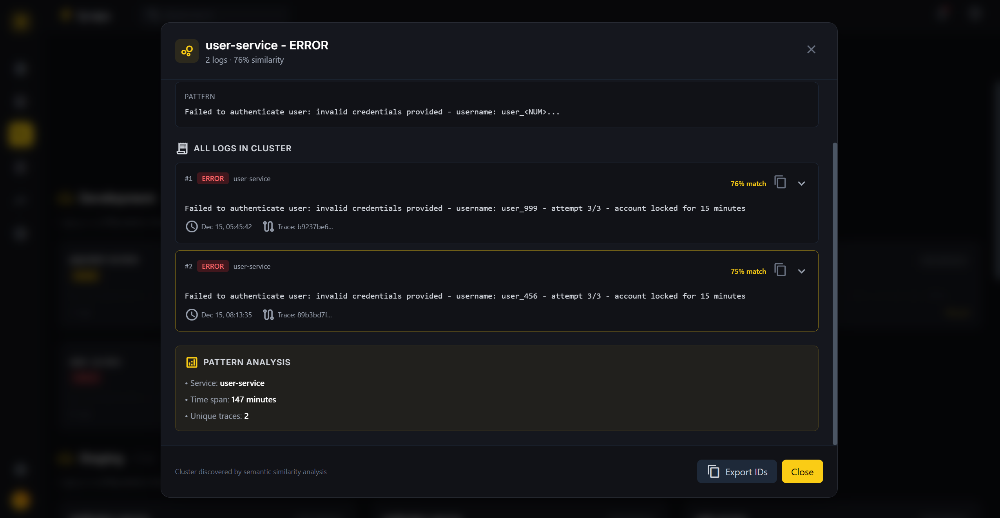

Finally you can investigate a specific log and in the clustered group and see all the full information about the log (from environment name, to podname, stacktraces, etc.)

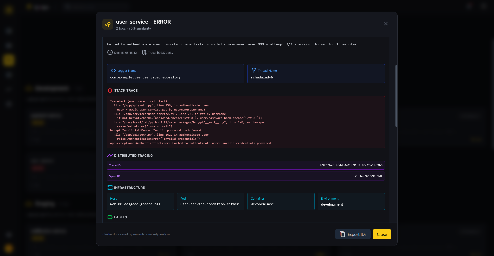

## 4. Insight pathway (report analysis)

The system generated analysis report (24 hours) that generated a summary of logs, root cause and potential fixes. It also provides a z-score anomaly dectection dashboard that covers the 24 hours period.

## 4.1. Executive summary

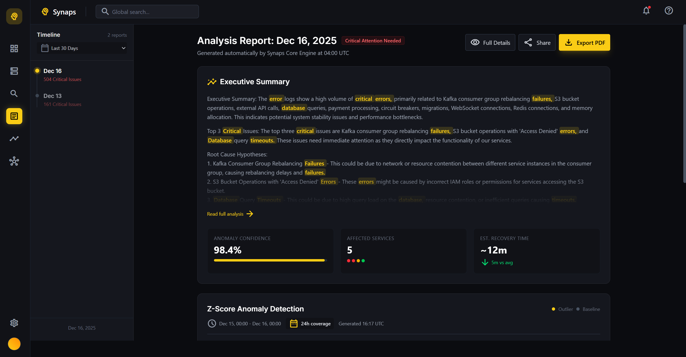

## 4.2. z-score anomaly detection

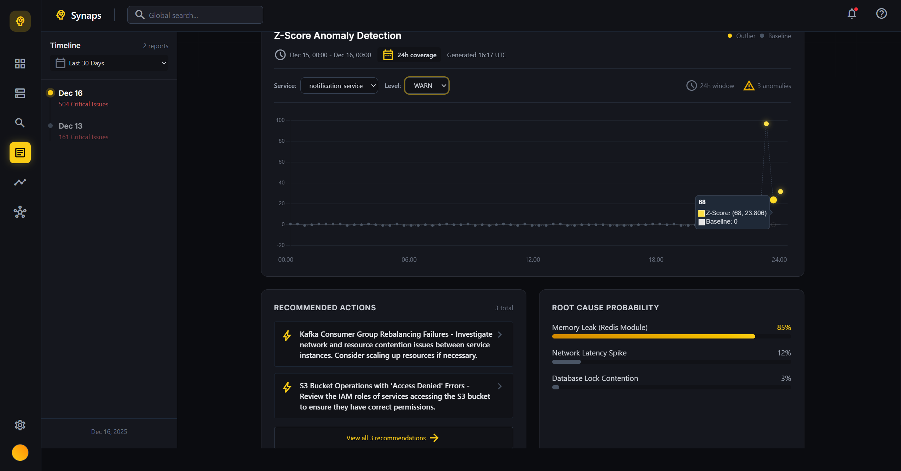

Expend report information shows the different statistics about information analysed during that period, such as total logs, how many logs at each level levels, the report generation time, the model used with token count, the recommendations, etc.

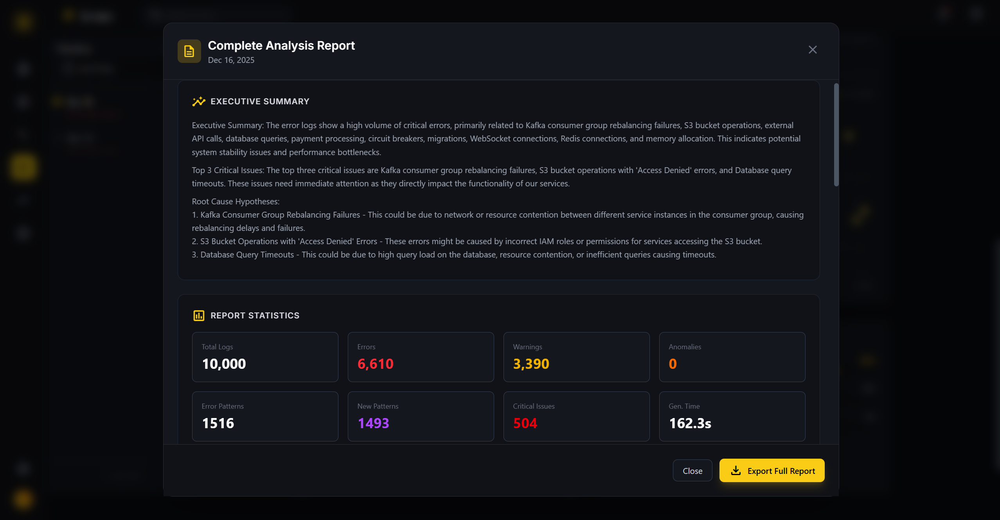
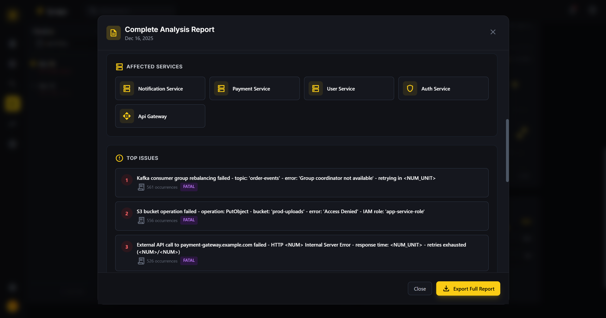
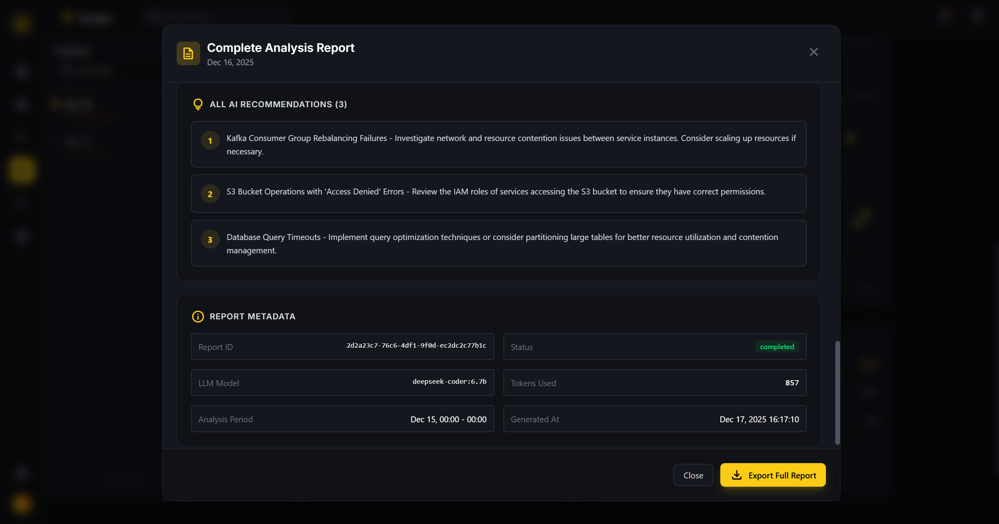

## 5. Metrics (anomaly detection & alerts)

Filtering the different anomaly reports and analysis


## 6. Topology (system architecture)

Shows flow of data for the system architecture

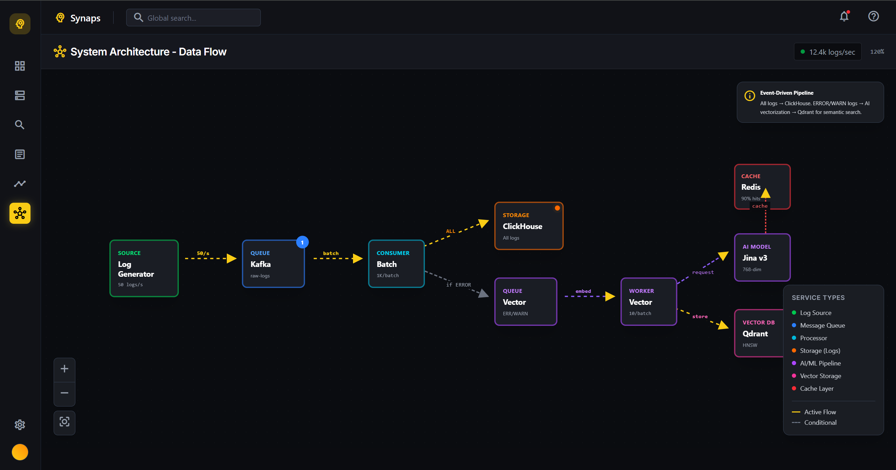
