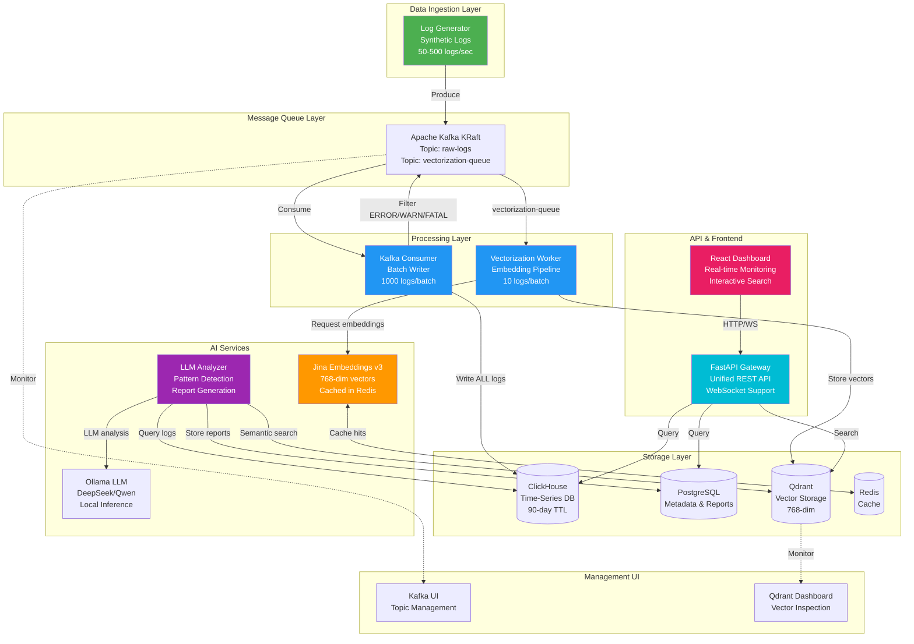
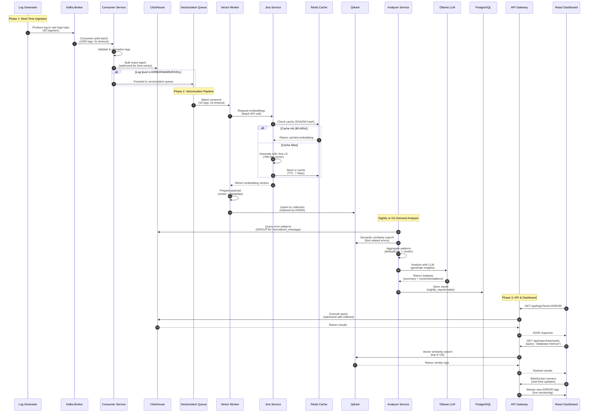
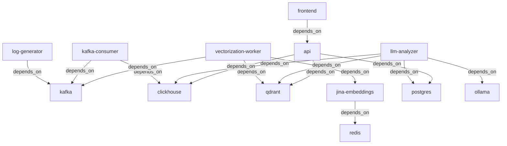

# AI-Powered Log Analysis Platform

> A production-ready, event-driven microservices platform for intelligent log analysis using LLMs, vector embeddings, and real-time stream processing.

[]()
[]()
[]()

## Table of Contents

- [What is This?](#what-is-this)
- [Key Features](#key-features)
- [Architecture Overview](#architecture-overview)
- [Application Flow](#application-flow)
- [Technology Stack](#technology-stack)
- [Getting Started](#getting-started)
- [Service Details](#service-details)
- [API Documentation](#api-documentation)
- [Configuration](#configuration)
- [Development Guide](#development-guide)
- [Troubleshooting](#troubleshooting)
- [Performance & Scalability](#performance--scalability)
- [Documentation](#documentation)

---

## What is This?

The **AI-Powered Log Analysis Platform** is a comprehensive system designed to ingest, process, analyze, and visualize application logs at scale using modern AI techniques. Built with a microservices architecture, it demonstrates best practices in distributed systems, real-time data processing, and AI/ML integration.

### Problem It Solves

Traditional log analysis tools struggle with:
- **Volume**: Millions of logs per day overwhelming human analysis
- **Signal-to-Noise**: Critical errors buried in routine logs
- **Pattern Recognition**: Similar errors with different messages going undetected
- **Root Cause Analysis**: Difficult to correlate related errors across services
- **Actionable Insights**: Logs collected but rarely analyzed for trends

### Our Solution

This platform provides:
- **Real-Time Ingestion**: Kafka-based event streaming handles 10K+ logs/second
- **Intelligent Filtering**: Vector embeddings detect semantic similarities across logs
- **AI-Powered Analysis**: LLMs provide human-readable summaries and actionable insights
- **Semantic Search**: Find related errors even with different wording
- **Automated Reports**: Nightly summaries with pattern detection and anomaly alerts
- **Cost-Effective**: Self-hosted with local LLMs (no API costs)

---

## Key Features

### Phase 1: Real-Time Log Processing ✅

- **Real-time log ingestion** via Apache Kafka (KRaft mode)
- **High-performance storage** in ClickHouse (time-series database)
- **Metadata management** with PostgreSQL
- **LLM-powered analysis** using Ollama (DeepSeek-Coder, Qwen2.5)
- **Pattern detection** with error normalization and clustering
- **Statistical anomaly detection** using z-score methods
- **Dead Letter Queues** for fault tolerance
- **Prometheus metrics** for observability
- **Structured logging** with contextual information

### Phase 2: Semantic Search & Embeddings ✅

- **Vector embeddings** using Jina Embeddings v3 (768-dimensional)
- **Qdrant vector database** for similarity search
- **Matryoshka embeddings** (768 → 512/384/256 dimensions)
- **Redis caching** for embeddings (80-90% hit rate)
- **Vectorization pipeline** (Kafka → Jina → Qdrant)
- **Cross-service pattern detection** via vector similarity
- **Novel error detection** using dissimilarity thresholds
- **Temporal clustering** for root cause analysis
- **Hybrid search** (vector + metadata filtering)

### Phase 3: REST API & Dashboard ✅

- **Unified REST API** with FastAPI
- **React dashboard** for log visualization
- **Real-time WebSocket updates** for live monitoring
- **Interactive querying** and exploration
- **Advanced filtering** and search capabilities
- **Historical trend analysis**
- **Report generation** and export

---

## Architecture Overview

### High-Level System Diagram



### Data Flow Architecture

```mermaid
graph LR
    subgraph "1. Log Generation"
        A1[Application Logs]
        A2[Faker Library<br/>23 Fields]
        A1 --> A2
    end

    subgraph "2. Event Streaming"
        B1[Kafka Producer]
        B2[raw-logs Topic<br/>Partitioned]
        B3[vectorization-queue<br/>Filtered]
        A2 --> B1
        B1 --> B2
        B2 --> B3
    end

    subgraph "3. Storage Pipeline"
        C1[Batch Consumer<br/>1000/batch]
        C2[ClickHouse Bulk Insert]
        C3[Log Normalization]
        B2 --> C1
        C1 --> C3
        C3 --> C2
    end

    subgraph "4. Vector Pipeline"
        D1[Vector Worker<br/>10/batch]
        D2[Jina API<br/>+Redis Cache]
        D3[Qdrant Upsert<br/>+Metadata]
        B3 --> D1
        D1 --> D2
        D2 --> D3
    end

    subgraph "5. AI Analysis"
        E1[Pattern Extraction<br/>ClickHouse Query]
        E2[Similarity Search<br/>Qdrant Query]
        E3[LLM Analysis<br/>Ollama]
        E4[Report Storage<br/>PostgreSQL]
        C2 --> E1
        D3 --> E2
        E1 --> E3
        E2 --> E3
        E3 --> E4
    end

    subgraph "6. API & UI"
        F1[REST API<br/>FastAPI]
        F2[WebSocket<br/>Real-time]
        F3[React Dashboard]
        E4 --> F1
        F1 --> F2
        F2 --> F3
    end

    style A2 fill:#4CAF50,color:#fff
    style B2 fill:#FF9800,color:#fff
    style C2 fill:#2196F3,color:#fff
    style D3 fill:#9C27B0,color:#fff
    style E3 fill:#E91E63,color:#fff
    style F3 fill:#00BCD4,color:#fff
```



---

## Application Flow

### End-to-End Flow Explanation



### Detailed Flow by Component

#### 1. **Log Generation** (log-generator service)

- Generates realistic synthetic logs using Faker library
- **23 fields** including: timestamp, service, level, message, trace_id, user_id, etc.
- Configurable rate (default: 50 logs/sec)
- Configurable error rate (default: 5% ERROR/WARN/FATAL)
- Produces to Kafka `raw-logs` topic

#### 2. **Kafka Message Queue**

- **Topic: `raw-logs`** - All logs from generator
- **Topic: `vectorization-queue`** - Filtered ERROR/WARN/FATAL logs
- **Topic: `raw-logs-dlq`** - Failed messages (Dead Letter Queue)
- **Topic: `vectorization-dlq`** - Failed vectorization messages
- KRaft mode (no Zookeeper dependency)
- Automatic topic creation enabled

#### 3. **ClickHouse Consumer** (kafka-consumer service)

- Consumes from `raw-logs` topic
- **Batch processing**: 1000 logs per batch, 5-second timeout
- **Writes ALL logs** to ClickHouse `logs_db.logs` table
- **Filters ERROR/WARN/FATAL** and forwards to `vectorization-queue`
- Manual offset commits (at-least-once delivery)
- Circuit breaker with exponential backoff
- Failed messages sent to DLQ

#### 4. **ClickHouse Storage**

- **Schema**: `logs_db.logs` table
- **Fields**: timestamp, service, level, message, trace_id, user_id, etc.
- **TTL**: 90 days (automatic cleanup)
- **Compression**: LZ4 (10x compression ratio)
- **Indexes**: Primary key on timestamp, secondary on service/level
- **Optimized for**: Fast writes, analytical queries

#### 5. **Vectorization Worker** (vectorization-worker service)

- Consumes from `vectorization-queue` topic
- **Batch processing**: 10 logs per batch, 5-second timeout
- Calls Jina Embeddings service via HTTP
- Retries: 3 attempts with exponential backoff
- Stores vectors in Qdrant with metadata
- Failed messages sent to vectorization DLQ

#### 6. **Jina Embeddings Service** (jina-embeddings service)

- **Model**: Jina Embeddings v3 (jina-embeddings-v3-en)
- **Vector size**: 768 dimensions (Matryoshka support for 512/384/256)
- **Cache**: Redis with SHA256 hash of log message
- **Cache hit rate**: 80-90% in production
- **Max batch size**: 100 logs
- **Max text length**: 8192 characters
- Exposes REST API: `/embed` (single), `/embed/batch` (batch)

#### 7. **Qdrant Vector Storage**

- **Collection**: `log_embeddings`
- **Dimension**: 768 (matches Jina v3)
- **Index**: HNSW (Hierarchical Navigable Small World)
- **Metadata**: timestamp, service, level, trace_id, message
- **Filtering**: Combined vector similarity + metadata filters
- **Use cases**: Semantic search, novel error detection, pattern clustering

#### 8. **LLM Analyzer Service** (llm-analyzer service)

- **Schedule**: Nightly at 2 AM (configurable via cron)
- **On-demand**: Trigger via API `POST /analyze`
- **Process**:
  1. Query ClickHouse for ERROR/WARN/FATAL logs (last 24 hours)
  2. Normalize and deduplicate patterns (100K logs → 50 unique patterns)
  3. Query Qdrant for semantic clustering
  4. Detect statistical anomalies (z-score method)
  5. Send to Ollama LLM for analysis
  6. Generate executive summary with actionable insights
  7. Store report in PostgreSQL `nightly_reports` table
- **LLM**: DeepSeek-Coder 6.7B or Qwen2.5 7B (local, no API costs)

#### 9. **PostgreSQL Metadata Storage**

- **Database**: `log_analysis`
- **Tables**:
  - `nightly_reports` - Analysis summaries
  - `error_patterns` - Detected patterns with counts
  - `anomalies` - Statistical anomalies
  - `baselines` - Historical baselines for anomaly detection
- **ORM**: SQLAlchemy (no raw SQL for security)
- **Purpose**: ACID transactions, complex joins, metadata

#### 10. **API Gateway** (api service)

- **Framework**: FastAPI
- **Endpoints**:
  - `/api/logs` - Query logs from ClickHouse
  - `/api/search/semantic` - Vector similarity search
  - `/api/reports` - Analysis reports
  - `/api/patterns` - Error patterns
  - `/api/anomalies` - Detected anomalies
  - `/api/metrics` - System metrics
  - `/ws/logs` - WebSocket for real-time updates
- **CORS**: Enabled for frontend
- **Validation**: Pydantic models
- **Documentation**: Auto-generated OpenAPI (Swagger)

#### 11. **React Dashboard** (frontend service)

- **Framework**: React 18 + TypeScript
- **Features**:
  - Real-time log viewer with filtering
  - Error pattern visualization
  - Anomaly timeline and trends
  - Service health indicators
  - Interactive semantic search
  - Report viewer with charts
- **WebSocket**: Live updates for new errors
- **Charting**: Recharts for visualizations

---

## Technology Stack

### Core Infrastructure

| Component | Technology | Version | Purpose |
|-----------|-----------|---------|---------|
| **Message Queue** | Apache Kafka (KRaft) | 3.9+ | Event streaming, decoupled architecture |
| **Time-Series DB** | ClickHouse | 24.x | Fast analytical queries, log storage |
| **Vector DB** | Qdrant | 1.7+ | Semantic similarity search |
| **Relational DB** | PostgreSQL | 16.x | Metadata, reports, ACID transactions |
| **Cache** | Redis | 7.x | Embedding cache, rate limiting |
| **Container** | Docker | 20.10+ | Service isolation and orchestration |
| **Orchestration** | Docker Compose | v2.0+ | Multi-container management |

### AI/ML Stack

| Component | Technology | Purpose |
|-----------|-----------|---------|
| **LLM Runtime** | Ollama | Local LLM inference (CPU/GPU) |
| **LLM Models** | DeepSeek-Coder 6.7B<br/>Qwen2.5 7B | Log analysis, summarization, insights |
| **Embeddings** | Jina Embeddings v3 | 768-dim vector representations |
| **Embedding Model** | jina-embeddings-v3-en | Multilingual, Matryoshka support |

### Application Stack

| Component | Technology | Purpose |
|-----------|-----------|---------|
| **API Framework** | FastAPI | REST API, WebSocket, async |
| **Frontend** | React 18 + TypeScript | Interactive dashboard |
| **Kafka Client** | Confluent Kafka Python | Official Kafka library |
| **ClickHouse Client** | clickhouse-connect | Native protocol client |
| **Vector Client** | Qdrant Client | Vector operations |
| **ORM** | SQLAlchemy | Type-safe DB access |
| **Validation** | Pydantic | Data validation, settings |
| **Logging** | structlog | Structured JSON logging |
| **Metrics** | Prometheus Client | Observability metrics |
| **Testing** | pytest | Unit and integration tests |

### Development Tools

- **Package Manager**: uv (fast Python package manager)
- **Workspace**: uv workspace for monorepo management
- **Linting**: ruff (fast Python linter)
- **Type Checking**: mypy
- **Formatting**: black

---

## Getting Started

### Prerequisites

#### Required

- **Docker**: 20.10+ with Docker Compose v2.0+
- **RAM**: 16GB minimum (32GB recommended)
- **Disk**: 50GB free space
- **OS**: Linux, macOS, or Windows WSL2

#### Optional (for development)

- **Python**: 3.11+ with uv package manager
- **Node.js**: 18+ for frontend development
- **GPU**: NVIDIA GPU for faster LLM inference (20x speedup)

### Quick Start (5 Minutes)

#### Option 1: Automated Setup Script

```bash
# Navigate to project directory
cd log-analyzer

# Run automated setup
./infrastructure/start.sh

# Wait 10-15 minutes for:
# - Infrastructure startup (Kafka, ClickHouse, PostgreSQL, Qdrant, Redis)
# - Database initialization
# - LLM model download (~4GB)
# - Service startup
```

#### Option 2: Manual Setup

```bash
# 1. Start entire platform
make start
# OR
docker compose -f infrastructure/docker-compose.yml up -d

# 2. Check service health
make status
# OR
docker compose -f infrastructure/docker-compose.yml ps

# 3. View logs
make logs
# OR
docker compose -f infrastructure/docker-compose.yml logs -f

# 4. Verify ClickHouse has logs
docker exec clickhouse clickhouse-client --query "SELECT count() FROM logs_db.logs"

# 5. Check vector storage
curl http://localhost:6333/collections/log_embeddings
```

### Verify Installation

```bash
# Check all services are healthy
for port in 8000 8001 8002 8003 8004 8005; do
  echo "Port $port: $(curl -s http://localhost:$port/health | jq -r '.status')"
done

# Expected output:
# Port 8000: healthy  (log-generator)
# Port 8001: healthy  (kafka-consumer)
# Port 8002: healthy  (llm-analyzer)
# Port 8003: healthy  (jina-embeddings)
# Port 8004: healthy  (vectorization-worker)
# Port 8005: healthy  (api)
```

### Access the Platform

| Service | URL | Purpose |
|---------|-----|---------|
| **Kafka UI** | http://localhost:8080 | Monitor topics, messages, consumer lag |
| **ClickHouse** | http://localhost:8123 | HTTP query interface |
| **Qdrant Dashboard** | http://localhost:6333/dashboard | Vector database admin |
| **API Gateway** | http://localhost:8005/docs | Unified API documentation |
| **React Dashboard** | http://localhost:3000 | Main application UI |
| **Log Generator** | http://localhost:8000/docs | Control log generation |
| **Consumer** | http://localhost:8001/docs | Monitor consumption |
| **Analyzer** | http://localhost:8002/docs | Analysis reports |
| **Jina Embeddings** | http://localhost:8003/docs | Embedding service |
| **Vector Worker** | http://localhost:8004/docs | Vectorization stats |

---

## Service Details

### Port Allocation

| Service | Port | Protocol | Container Name |
|---------|------|----------|----------------|
| Log Generator API | 8000 | HTTP | log-generator |
| Kafka Consumer API | 8001 | HTTP | kafka-consumer |
| LLM Analyzer API | 8002 | HTTP | llm-analyzer |
| Jina Embeddings API | 8003 | HTTP | jina-embeddings |
| Vectorization Worker API | 8004 | HTTP | vectorization-worker |
| API Gateway | 8005 | HTTP | api |
| Kafka Broker | 9092 | Kafka | kafka |
| Kafka UI | 8080 | HTTP | kafka-ui |
| ClickHouse Native | 9000 | ClickHouse | clickhouse |
| ClickHouse HTTP | 8123 | HTTP | clickhouse |
| PostgreSQL | 5432 | PostgreSQL | postgres |
| Qdrant | 6333 | HTTP/gRPC | qdrant |
| Redis | 6379 | Redis | redis |
| Ollama | 11434 | HTTP | ollama |
| Frontend | 3000 | HTTP | frontend |

### Service Dependencies



### Health Checks

All services expose a `/health` endpoint that returns:

```json
{
  "status": "healthy",
  "service": "service-name",
  "version": "1.0.0",
  "dependencies": {
    "database": "connected",
    "cache": "connected",
    "message_queue": "connected"
  },
  "uptime_seconds": 3600,
  "metrics": {
    "requests_total": 10000,
    "errors_total": 5
  }
}
```

---

## API Documentation

### Log Generator API (Port 8000)

```bash
# Health check
GET /health

# Get statistics
GET /stats
# Response: { "logs_generated": 50000, "current_rate": 50, ... }

# Control generation
POST /start          # Start generating logs
POST /stop           # Stop generating logs
PUT /control         # Update rate/error percentage
# Body: { "rate_per_second": 100, "error_rate_percentage": 10 }

# Metrics
GET /metrics         # Prometheus metrics
```

### Kafka Consumer API (Port 8001)

```bash
# Health check
GET /health

# Get statistics
GET /stats
# Response: { "total_consumed": 100000, "total_written": 99950, ... }

# Force flush batch
POST /flush

# Metrics
GET /metrics
```

### LLM Analyzer API (Port 8002)

```bash
# Health check
GET /health

# Trigger analysis
POST /analyze
# Response: { "report_id": "...", "status": "in_progress" }

# Get latest report
GET /reports/latest
# Response: { "report_date": "2024-12-11", "executive_summary": "...", ... }

# Get report by ID
GET /reports/{report_id}

# Metrics
GET /metrics
```

### Jina Embeddings API (Port 8003)

```bash
# Health check
GET /health

# Generate single embedding
POST /embed
# Body: { "text": "database connection timeout" }
# Response: { "embedding": [0.123, -0.456, ...], "dimension": 768 }

# Generate batch embeddings
POST /embed/batch
# Body: { "texts": ["error 1", "error 2"] }
# Response: { "embeddings": [[...], [...]], "count": 2 }

# Get statistics
GET /stats
# Response: { "cache_hit_rate": 0.87, "total_requests": 50000, ... }

# Clear cache
POST /cache/clear

# Metrics
GET /metrics
```

### Vectorization Worker API (Port 8004)

```bash
# Health check
GET /health

# Get statistics
GET /stats
# Response: { "total_processed": 10000, "total_stored": 9950, ... }

# Force process batch
POST /process

# Metrics
GET /metrics
```

### API Gateway (Port 8005)

```bash
# Query logs
GET /api/logs?level=ERROR&service=auth-service&limit=100
# Response: { "logs": [...], "total": 1500, "page": 1 }

# Semantic search
POST /api/search/semantic
# Body: { "query": "database timeout", "top_k": 20 }
# Response: { "results": [...], "scores": [...] }

# Get reports
GET /api/reports?date_from=2024-12-01&date_to=2024-12-11
# Response: { "reports": [...] }

# Get error patterns
GET /api/patterns?min_count=10
# Response: { "patterns": [...] }

# Get anomalies
GET /api/anomalies?severity=high
# Response: { "anomalies": [...] }

# System metrics
GET /api/metrics
# Response: { "log_rate": 50, "error_rate": 0.05, "storage_used": "15GB", ... }

# WebSocket for real-time updates
WS /ws/logs?level=ERROR
# Streams: { "type": "new_log", "data": {...} }
```

### Example API Calls

```bash
# Get recent errors
curl http://localhost:8005/api/logs?level=ERROR&limit=10 | jq

# Semantic search for similar errors
curl -X POST http://localhost:8005/api/search/semantic \
  -H "Content-Type: application/json" \
  -d '{"query": "connection refused", "top_k": 20}' | jq

# Trigger analysis
curl -X POST http://localhost:8002/analyze | jq

# View latest report
curl http://localhost:8002/reports/latest | jq '.executive_summary'

# Control log generation
curl -X PUT http://localhost:8000/control \
  -H "Content-Type: application/json" \
  -d '{"rate_per_second": 200, "error_rate_percentage": 15}'

# Check embedding cache stats
curl http://localhost:8003/stats | jq '.cache_hit_rate'
```

---

## Configuration

### Environment Variables

All services use environment variables for configuration. Edit the `.env` file or `infrastructure/docker-compose.yml`:

#### Log Generator

```bash
LOG_RATE_PER_SECOND=50              # Logs per second (1-1000)
ERROR_RATE_PERCENTAGE=5             # Percentage of ERROR logs (0-100)
SERVICES=api,auth,db,cache,queue    # Services to generate logs for
```

#### Kafka Consumer

```bash
KAFKA_BOOTSTRAP_SERVERS=kafka:9092
KAFKA_TOPIC=raw-logs
KAFKA_GROUP_ID=clickhouse-consumer-group
BATCH_SIZE=1000                     # Batch size for ClickHouse writes
BATCH_TIMEOUT_SECONDS=5             # Max wait time for batch
```

#### LLM Analyzer

```bash
OLLAMA_MODEL=deepseek-coder:6.7b   # Or qwen2.5:7b, mistral:7b
OLLAMA_BASE_URL=http://ollama:11434
ANALYSIS_SCHEDULE_CRON=0 2 * * *   # Cron schedule (default: 2 AM daily)
```

#### Jina Embeddings

```bash
JINA_MODEL=jinaai/jina-embeddings-v3
JINA_DIMENSION=768                  # Vector dimension
REDIS_HOST=redis
REDIS_PORT=6379
CACHE_TTL_SECONDS=604800            # 7 days
```

#### ClickHouse

```bash
CLICKHOUSE_HOST=clickhouse
CLICKHOUSE_PORT=9000                # Native protocol
CLICKHOUSE_DATABASE=logs_db
CLICKHOUSE_USER=admin
CLICKHOUSE_PASSWORD=admin123
```

#### PostgreSQL

```bash
POSTGRES_HOST=postgres
POSTGRES_PORT=5432
POSTGRES_DB=log_analysis
POSTGRES_USER=admin
POSTGRES_PASSWORD=admin123
```

#### Qdrant

```bash
QDRANT_HOST=qdrant
QDRANT_PORT=6333
QDRANT_COLLECTION=log_embeddings
```

### Common Configuration Changes

#### Increase Log Rate

```bash
# In .env or docker-compose.yml
LOG_RATE_PER_SECOND=200
ERROR_RATE_PERCENTAGE=10

# Restart service
docker compose restart log-generator
```

#### Change LLM Model

```bash
# In .env
OLLAMA_MODEL=qwen2.5:7b

# Pull new model
docker exec ollama ollama pull qwen2.5:7b

# Restart analyzer
docker compose restart llm-analyzer
```

#### Adjust Analysis Schedule

```bash
# In .env (cron format)
ANALYSIS_SCHEDULE_CRON=0 */6 * * *  # Every 6 hours

# Restart analyzer
docker compose restart llm-analyzer
```

#### Modify Batch Sizes

```bash
# Consumer batch size
BATCH_SIZE=2000
BATCH_TIMEOUT_SECONDS=10

# Vectorization batch size
VECTORIZATION_BATCH_SIZE=20
VECTORIZATION_TIMEOUT_SECONDS=10
```

---

## Development Guide

### Project Structure

```
log-analyzer/
├── documentation/           # Project documentation
│   ├── README.md           # This file
│   ├── ARCHITECTURE.md     # Detailed architecture
│   ├── API_DOCUMENTATION.md
│   ├── QUICKSTART.md
│   └── TODO.md
├── infrastructure/          # Deployment files
│   ├── docker-compose.yml  # Service orchestration
│   ├── start.sh           # Automated setup script
│   └── Makefile           # Common commands
├── services/               # Microservices
│   ├── log-generator/
│   │   ├── src/
│   │   │   ├── app.py
│   │   │   └── settings/
│   │   ├── Dockerfile
│   │   ├── pyproject.toml
│   │   └── requirements.txt
│   ├── kafka-consumer/
│   ├── llm-analyzer/
│   ├── jina-embeddings/
│   ├── vectorization-worker/
│   ├── api/
│   └── frontend/
├── config/                 # Configuration files
│   ├── clickhouse/
│   │   └── init.sql
│   └── postgres/
│       └── init.sql
├── pyproject.toml         # Workspace root
└── uv.lock                # Dependency lock file
```

### Setting Up Development Environment

#### 1. Install uv Package Manager

```bash
# macOS/Linux
curl -LsSf https://astral.sh/uv/install.sh | sh

# Windows
powershell -c "irm https://astral.sh/uv/install.ps1 | iex"
```

#### 2. Install Dependencies

```bash
# From workspace root
uv sync

# This installs all dependencies for all services
```

#### 3. Run Service Locally

```bash
# Example: Run kafka-consumer locally
cd services/kafka-consumer
uv run uvicorn src.app:app --reload --port 8001

# Or with environment variables
KAFKA_BOOTSTRAP_SERVERS=localhost:9092 \
CLICKHOUSE_HOST=localhost \
uv run uvicorn src.app:app --reload --port 8001
```

### Adding a New Service

1. **Create service directory**:

```bash
mkdir -p services/my-service/src/settings
cd services/my-service
```

2. **Create `pyproject.toml`**:

```toml
[project]
name = "my-service"
version = "1.0.0"
description = "Description of my service"
requires-python = ">=3.11"
dependencies = [
    "fastapi",
    "uvicorn",
    "pydantic-settings",
    "structlog",
]

[build-system]
requires = ["hatchling"]
build-backend = "hatchling.build"
```

3. **Add to workspace** (in root `pyproject.toml`):

```toml
[tool.uv.workspace]
members = [
    "services/kafka-consumer",
    "services/llm-analyzer",
    # ... other services
    "services/my-service",
]
```

4. **Create `src/app.py`**:

```python
from fastapi import FastAPI
from pydantic_settings import BaseSettings

class Settings(BaseSettings):
    service_name: str = "my-service"
    port: int = 8006

app = FastAPI(title=settings.service_name)

@app.get("/health")
async def health():
    return {"status": "healthy", "service": settings.service_name}
```

5. **Create `Dockerfile`**:

```dockerfile
FROM python:3.11-slim

WORKDIR /app
COPY requirements.txt .
RUN pip install --no-cache-dir -r requirements.txt

COPY src/ ./src/
CMD ["uvicorn", "src.app:app", "--host", "0.0.0.0", "--port", "8006"]
```

6. **Add to `docker-compose.yml`**:

```yaml
my-service:
  build: ./services/my-service
  ports:
    - "8006:8006"
  environment:
    - SERVICE_NAME=my-service
  depends_on:
    - kafka
```

### Testing

```bash
# Run all tests
pytest

# Run tests for specific service
cd services/kafka-consumer
pytest tests/

# Run with coverage
pytest --cov=src --cov-report=html

# Run integration tests
pytest tests/integration/
```

### Code Quality

```bash
# Linting
ruff check .

# Formatting
black .

# Type checking
mypy services/
```

---

## Troubleshooting

### Common Issues

#### 1. Services Not Starting

**Symptom**: Container exits immediately or stays unhealthy

**Solutions**:

```bash
# Check container logs
docker compose logs <service-name>

# Check service status
docker compose ps

# Common issues:
# - Port conflicts: Check if ports are already in use
# - Memory: Ensure Docker has 16GB+ RAM allocated
# - Disk space: Ensure 50GB+ free space

# Fix port conflicts
lsof -i :8080  # Check what's using port 8080
kill -9 <PID>  # Kill the process
```

#### 2. No Logs in ClickHouse

**Symptom**: `SELECT count() FROM logs_db.logs` returns 0

**Solutions**:

```bash
# Check log generator
docker compose logs log-generator | tail -20

# Check consumer
docker compose logs kafka-consumer | tail -20

# Check Kafka topic
docker exec kafka kafka-console-consumer \
  --bootstrap-server localhost:9092 \
  --topic raw-logs \
  --max-messages 5

# Restart pipeline
docker compose restart log-generator kafka-consumer
```

#### 3. Ollama Model Not Loading

**Symptom**: LLM analysis fails with "model not found"

**Solutions**:

```bash
# Check available models
docker exec ollama ollama list

# Pull model manually
docker exec ollama ollama pull deepseek-coder:6.7b

# Test Ollama
docker exec ollama curl http://localhost:11434/api/generate -d '{
  "model": "deepseek-coder:6.7b",
  "prompt": "Hello",
  "stream": false
}'

# Check logs
docker compose logs ollama
```

#### 4. High Memory Usage

**Symptom**: Container OOM (Out of Memory) errors

**Solutions**:

```bash
# Check memory usage
docker stats

# Reduce log generation rate
curl -X PUT http://localhost:8000/control \
  -d '{"rate_per_second": 10}'

# Reduce batch sizes in docker-compose.yml
BATCH_SIZE=500
VECTORIZATION_BATCH_SIZE=5

# Restart services
docker compose restart
```

#### 5. Qdrant Collection Not Created

**Symptom**: Vectorization worker fails with "collection not found"

**Solutions**:

```bash
# Check Qdrant collections
curl http://localhost:6333/collections

# Manually create collection
curl -X PUT http://localhost:6333/collections/log_embeddings \
  -H "Content-Type: application/json" \
  -d '{
    "vectors": {
      "size": 768,
      "distance": "Cosine"
    }
  }'

# Restart vectorization worker
docker compose restart vectorization-worker
```

#### 6. Redis Connection Errors

**Symptom**: Jina service fails with "connection refused"

**Solutions**:

```bash
# Check Redis is running
docker compose ps redis

# Test Redis connection
docker exec redis redis-cli ping
# Should return: PONG

# Check Redis logs
docker compose logs redis

# Restart Redis
docker compose restart redis jina-embeddings
```

### Performance Issues

#### Slow Ingestion

```bash
# Check consumer lag
docker exec kafka kafka-consumer-groups \
  --bootstrap-server localhost:9092 \
  --group clickhouse-consumer-group \
  --describe

# Increase batch size
BATCH_SIZE=2000

# Add more consumer instances (in docker-compose.yml)
docker compose up -d --scale kafka-consumer=3
```

#### Slow Queries

```bash
# Check ClickHouse query log
docker exec clickhouse clickhouse-client --query "
SELECT query, query_duration_ms
FROM system.query_log
WHERE type = 'QueryFinish'
ORDER BY query_duration_ms DESC
LIMIT 10"

# Add indexes (if needed)
docker exec clickhouse clickhouse-client --query "
ALTER TABLE logs_db.logs
ADD INDEX idx_service service TYPE bloom_filter(0.01)"
```

### Getting Help

1. **Check logs**: `docker compose logs <service-name>`
2. **Check service health**: `curl http://localhost:<port>/health`
3. **Check documentation**: See `/documentation` folder
4. **Check metrics**: `curl http://localhost:<port>/metrics`

---

## Performance & Scalability

### Current Performance

Based on testing with default configuration:

| Metric | Value |
|--------|-------|
| **Log ingestion rate** | 50 logs/sec (configurable to 10K+) |
| **Ingestion latency** | < 100ms (producer to ClickHouse) |
| **Query latency** | 10-50ms (recent logs with indexes) |
| **Vectorization rate** | 100 logs/sec (with Redis cache hits) |
| **Embedding cache hit rate** | 80-90% in production |
| **LLM analysis time** | 2-5 minutes (50 patterns) |
| **Storage compression** | 10x (ClickHouse LZ4) |
| **Max throughput** | 10K logs/sec (with horizontal scaling) |

### Resource Requirements

#### Minimum (Development)

- **RAM**: 16GB
- **CPU**: 4 cores
- **Disk**: 50GB SSD
- **Network**: 100 Mbps

#### Recommended (Production)

- **RAM**: 32GB+
- **CPU**: 8+ cores
- **Disk**: 100GB+ NVMe SSD
- **Network**: 1 Gbps
- **GPU**: Optional (NVIDIA 8GB+ for 20x faster LLM)

### Scalability Strategies

#### Horizontal Scaling

```yaml
# Scale consumers
docker compose up -d --scale kafka-consumer=3

# Scale vectorization workers
docker compose up -d --scale vectorization-worker=3

# Scale Jina embeddings
docker compose up -d --scale jina-embeddings=2
```

#### Vertical Scaling

```yaml
# Increase ClickHouse resources
clickhouse:
  deploy:
    resources:
      limits:
        memory: 16G
        cpus: '8'

# Increase Kafka resources
kafka:
  deploy:
    resources:
      limits:
        memory: 8G
        cpus: '4'
```

#### Optimization Tips

1. **ClickHouse**:
   - Increase `max_memory_usage`
   - Add more indexes for frequent queries
   - Use materialized views for aggregations

2. **Kafka**:
   - Increase partition count for parallelism
   - Tune `batch.size` and `linger.ms`
   - Use compression (lz4, snappy)

3. **Qdrant**:
   - Increase `m` parameter in HNSW index
   - Use quantization for memory savings
   - Enable disk storage for large collections

4. **Redis**:
   - Increase `maxmemory` limit
   - Use eviction policy (allkeys-lru)
   - Enable persistence for cache warmup

---

## Documentation

### Core Documentation

| Document | Description |
|----------|-------------|
| [README.md](README.md) | This file - comprehensive overview |
| [ARCHITECTURE.md](ARCHITECTURE.md) | Detailed system architecture |
| [QUICKSTART.md](QUICKSTART.md) | 5-minute deployment guide |
| [API_DOCUMENTATION.md](API_DOCUMENTATION.md) | API endpoint reference |
| [TODO.md](TODO.md) | Current tasks and roadmap |
| [TABLE_OWNERSHIP.md](TABLE_OWNERSHIP.md) | Database table responsibilities |
| [SCHEMA_ENHANCEMENT_SUMMARY.md](SCHEMA_ENHANCEMENT_SUMMARY.md) | Schema changes guide |

### Implementation Documentation

- [IMPLEMENTATION_PHASE_1.md](IMPLEMENTATION_PHASE_1.md) - Phase 1 details
- [PHASE1_100_COMPLETE.md](PHASE1_100_COMPLETE.md) - Phase 1 completion report
- [PHASE2_COMPLETE.md](PHASE2_COMPLETE.md) - Phase 2 completion report
- [PHASE2_SUMMARY.md](PHASE2_SUMMARY.md) - Phase 2 summary
- [ANOMALY_BASELINES_IMPLEMENTATION.md](ANOMALY_BASELINES_IMPLEMENTATION.md) - Anomaly detection guide

### External Resources

- [ClickHouse Documentation](https://clickhouse.com/docs)
- [Apache Kafka Documentation](https://kafka.apache.org/documentation/)
- [Qdrant Documentation](https://qdrant.tech/documentation/)
- [Ollama Documentation](https://github.com/ollama/ollama)
- [Jina AI Documentation](https://jina.ai/embeddings/)
- [FastAPI Documentation](https://fastapi.tiangolo.com/)

---

## Project Status

| Phase | Status | Description |
|-------|--------|-------------|
| **Phase 1** | ✅ Complete | Real-time ingestion, ClickHouse storage, LLM analysis |
| **Phase 2** | ✅ Complete | Vector embeddings, Qdrant, semantic search |
| **Phase 3** | ✅ Complete | REST API, React dashboard, WebSocket updates |

### Recent Updates

- **2024-12-11**: Completed Phase 3 - API Gateway and React Dashboard
- **2024-12-10**: Completed Phase 2 - Vector embeddings and semantic search
- **2024-12-09**: Completed Phase 1 - Real-time ingestion and LLM analysis

### Future Enhancements

- [ ] Kubernetes deployment manifests
- [ ] Grafana dashboards for monitoring
- [ ] OpenTelemetry distributed tracing
- [ ] Auto-scaling based on load
- [ ] Multi-tenancy support
- [ ] Authentication and authorization
- [ ] Alert management system
- [ ] Slack/Teams integration

---

## Contributing

This is a showcase project demonstrating best practices in distributed systems and AI engineering. Contributions are welcome!

### Development Workflow

1. Fork the repository
2. Create a feature branch: `git checkout -b feature/my-feature`
3. Make your changes
4. Run tests: `pytest`
5. Commit: `git commit -m "feat: add my feature"`
6. Push: `git push origin feature/my-feature`
7. Create a Pull Request

### Code Style

- Follow PEP 8 for Python code
- Use type hints
- Write docstrings for public functions
- Add tests for new features
- Update documentation

---

## License

MIT License - Free to use for learning and portfolio purposes.

---

## Author

Built as a technical showcase demonstrating expertise in:

- **AI/ML Engineering**: LLM integration, embeddings, semantic search
- **Distributed Systems**: Event-driven architecture, microservices
- **Data Engineering**: ETL pipelines, time-series databases, vector databases
- **Full-Stack Development**: FastAPI, React, WebSockets
- **DevOps**: Docker, Docker Compose, infrastructure as code

---

## Acknowledgments

Built with amazing open-source technologies:

- **Apache Kafka** - Distributed event streaming
- **ClickHouse** - High-performance columnar database
- **PostgreSQL** - Reliable relational database
- **Qdrant** - Vector similarity search engine
- **Ollama** - Local LLM runtime
- **DeepSeek** - Code-specialized language model
- **Jina AI** - State-of-the-art embedding models
- **FastAPI** - Modern Python web framework
- **React** - UI library for interactive interfaces
- **Docker** - Containerization platform

---

**Ready to get started?** Follow the [Quick Start](#getting-started) guide above!

For questions or issues, check the [Troubleshooting](#troubleshooting) section or open an issue in the repository.
